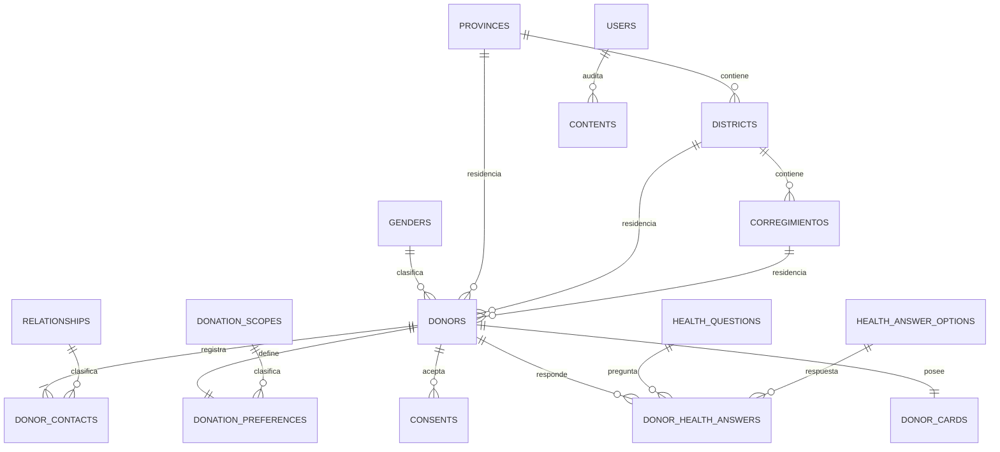

# Arquitectura de Base de Datos

## 1. Propósito

Este documento describe el esquema inicial de datos de **DONA ÓRGANOS PANAMÁ**, sus relaciones, catálogos, reglas de integridad y consideraciones de seguridad. La fuente ejecutable del esquema son las migraciones ubicadas en `database/migrations`.

La base local se ejecuta con MySQL 8.4 LTS en Docker. La instalación productiva podrá utilizar MySQL 8.4 LTS directamente en Ubuntu sin modificar el modelo ni las migraciones.

## 2. Principios del modelo

- Separar identificación, contactos, salud, consentimiento, preferencias y carnet.
- Minimizar y proteger los datos personales y sensibles.
- Usar catálogos controlados en lugar de valores escritos libremente.
- Conservar trazabilidad de consentimientos y cambios de estado.
- No eliminar donantes como parte del flujo funcional.
- Mantener únicamente los estados `active` y `withdrawn`, mostrados como `Activo` y `Baja`.
- Separar el folio visible del token secreto usado por el QR.
- Conservar contenidos eliminados mediante papelera y auditoría.

## 3. Diagrama general



La aplicación exigirá al menos un contacto por donante, aunque esa regla se valida transaccionalmente en el módulo de registro y no mediante una restricción simple de base de datos.

## 4. Tablas del dominio

### `users`

Usuarios autorizados para acceder a la administración.

| Campo | Descripción |
|---|---|
| `id` | Identificador interno |
| `name` | Nombre del usuario |
| `email` | Correo único de acceso |
| `email_verified_at` | Verificación del correo, si se utiliza |
| `password` | Contraseña almacenada mediante hash seguro |
| `role` | Rol técnico; inicialmente `administrator` |
| `is_active` | Habilita o bloquea el acceso |
| `last_login_at` | Último acceso correcto |
| `remember_token` | Token administrado por Laravel |
| `created_at`, `updated_at` | Auditoría temporal básica |

### `donors`

Registro principal del donante.

| Campo | Descripción |
|---|---|
| `id` | Identificador interno no público |
| `document_type` | Tipo de documento; inicialmente `cedula` |
| `document_number` | Documento normalizado y único |
| `full_name` | Nombre completo |
| `birth_date` | Fecha de nacimiento |
| `gender_id` | Género del catálogo |
| `email`, `phone` | Datos de contacto |
| `province_id`, `district_id`, `corregimiento_id` | Residencia mediante catálogos |
| `status` | `active` o `withdrawn` |
| `registered_at` | Fecha de registro tomada del servidor |
| `withdrawn_at` | Fecha de baja; nula mientras esté activo |
| `created_at`, `updated_at` | Auditoría temporal básica |

El documento es único. No existen columnas de aceptación, rechazo o validación administrativa.

### `donor_contacts`

Contactos informados asociados al donante. Admite varios contactos y uno de ellos debe marcarse como principal.

| Campo | Descripción |
|---|---|
| `donor_id` | Donante propietario |
| `relationship_id` | Parentesco controlado |
| `full_name` | Nombre del contacto |
| `email` | Correo opcional |
| `phone` | Teléfono |
| `is_informed` | Indica si conoce la decisión |
| `is_primary` | Identifica el contacto principal |

### `donation_preferences`

Una preferencia vigente por donante.

| Campo | Descripción |
|---|---|
| `donor_id` | Relación única con el donante |
| `donation_scope_id` | Alcance elegido |
| `research_authorized` | Autorización para investigación o docencia |

### `consents`

Evidencia versionada de los textos y autorizaciones aceptados.

| Campo | Descripción |
|---|---|
| `donor_id` | Donante que acepta |
| `version` | Versión del conjunto de textos |
| `signed_name` | Nombre escrito como firma |
| `voluntary_accepted` | Aceptación voluntaria |
| `electronically_accepted` | Confirmación electrónica |
| `sensitive_data_authorized` | Autorización para tratar datos sensibles |
| `institutional_query_authorized` | Autorización de consulta institucional |
| `cornea_information_acknowledged` | Confirmación informativa específica |
| `accepted_at` | Hora de aceptación del servidor |
| `request_id` | Identificador técnico correlacionable |
| `ip_address`, `user_agent` | Evidencia técnica opcional sujeta a política de privacidad |
| `revoked_at` | Fecha de revocación, cuando corresponda |

La combinación de donante y versión es única para evitar duplicar la misma aceptación.

### `health_questions`

Cuestionario médico versionado. Incluye código estable, texto, orden, obligatoriedad y vigencia. Las preguntas iniciales cubren enfermedades infecciosas, cáncer sistémico, condiciones corneales y cirugías oculares.

### `donor_health_answers`

Respuestas médicas del donante. Cada combinación de donante y pregunta es única. Estos datos tienen sensibilidad muy alta y no deben aparecer en QR, correo, logs ni exportaciones generales.

Las respuestas médicas no cambian el estado del donante ni generan aceptación o rechazo automático.

### `donor_cards`

Un carnet por donante.

| Campo | Descripción |
|---|---|
| `donor_id` | Relación única con el donante |
| `folio` | Folio público único con formato `DC2026-0000001` |
| `public_token_hash` | Hash SHA-256 del token aleatorio del QR |
| `issued_at` | Fecha de emisión |
| `revoked_at` | Invalida el carnet cuando el donante solicita la baja |

El token original no debe guardarse en texto plano cuando el flujo pueda validarlo mediante hash. La URL del QR no debe contener nombre, documento, ID interno ni folio.

### `contents`

Contenido editorial administrado por el CMS.

| Campo | Descripción |
|---|---|
| `type` | `legal`, `myth`, `faq` o `story` |
| `title`, `subtitle`, `body` | Título, identificación opcional y contenido enriquecido sanitizado |
| `is_visible` | Publicación en el portal |
| `sort_order` | Orden dentro de la categoría |
| `created_by`, `updated_by`, `deleted_by` | Usuarios responsables |
| `published_at` | Fecha de publicación |
| `deleted_at` | Eliminación lógica y papelera |
| `created_at`, `updated_at` | Auditoría temporal básica |

Ocultar y eliminar son acciones diferentes: `is_visible` controla la publicación y `deleted_at` mueve el contenido a la papelera.

### `content_media`

Metadatos del archivo opcional asociado a un contenido. El archivo físico se conserva en el disco configurado por Laravel; la base de datos no almacena BLOBs.

| Campo | Descripción |
|---|---|
| `content_id` | Relación única con el contenido |
| `media_type` | `image` para aspectos legales o `video` para historias personales |
| `disk`, `path` | Disco y ruta relativa del archivo físico |
| `original_name`, `mime_type`, `size_bytes` | Metadatos técnicos del archivo |
| `width`, `height` | Dimensiones de las imágenes |
| `duration_seconds` | Duración opcional de videos |
| `alt_text` | Descripción accesible obligatoria cuando existe una imagen |
| `created_by`, `updated_by`, `deleted_by` | Usuarios responsables |
| `deleted_at` | Baja lógica del metadato |

Las imágenes se admiten únicamente en Aspectos Legales y los videos únicamente en Historias Personales. El título y el texto siguen siendo obligatorios aunque exista multimedia. La eliminación lógica conserva inicialmente el archivo para permitir auditoría o recuperación; una limpieza física posterior debe ejecutarse mediante un procedimiento controlado.

## 5. Catálogos

### Catálogos controlados

`genders`, `relationships`, `donation_scopes` y `health_answer_options` comparten:

| Campo | Descripción |
|---|---|
| `code` | Código técnico estable y único |
| `name` | Etiqueta visible en español |
| `sort_order` | Orden de presentación |
| `is_active` | Disponibilidad para nuevos registros |

Valores iniciales:

- Género: Femenino, Masculino, Otro y Prefiero no indicar.
- Parentesco: Hermano(a), Padre/Madre, Cónyuge, Hijo(a), Amistad y Otro.
- Alcance: Solo córneas; Órganos y tejidos.
- Salud: Sí, No y No sé.

### Catálogos geográficos

- `provinces`: provincia o comarca, tipo y código oficial opcional.
- `districts`: pertenece a una provincia o comarca.
- `corregimientos`: pertenece a un distrito.

Los nombres iniciales podrán sustituirse o completarse con un insumo oficial. Los identificadores internos preservan las relaciones y `official_code` permite incorporar códigos institucionales. Las divisiones usadas históricamente deben desactivarse en lugar de eliminarse.

La carga inicial proviene de una copia versionada de [`provincias.json`](https://gist.github.com/Yizack/cbe7cef5572e6b832da0e9bd3454b312), publicada por Yizack y descrita por su autor como actualizada en 2022. Contiene 14 divisiones de primer nivel, 83 distritos y 702 corregimientos. Esta fuente es más completa que el conjunto parcial del mockup, pero se considera provisional hasta contrastarla con un insumo institucional vigente.

La copia utilizada se conserva en `database/data/panama-geography.json` para que las instalaciones sean reproducibles y no dependan de descargar el gist. `GeographyCatalogSeeder` limpia caracteres Unicode invisibles, conserva los nombres y códigos ISO incluidos y puede ejecutarse repetidamente sin duplicar filas.

## 6. Tablas técnicas de Laravel

- `migrations`: migraciones ejecutadas.
- `sessions`: sesiones web cuando se usa el controlador de base de datos.
- `password_reset_tokens`: restablecimiento de contraseña.
- `cache` y `cache_locks`: caché y bloqueos.
- `jobs`, `job_batches` y `failed_jobs`: colas y trabajos fallidos.

## 7. Índices y reglas de integridad

- Documento del donante único.
- Folio y hash del token QR únicos.
- Correo administrativo único.
- Una preferencia y un carnet por donante.
- Una respuesta por donante y pregunta médica.
- Una aceptación por donante y versión de consentimiento.
- Índices para estado, fecha de registro, provincia, nacimiento, visibilidad y orden editorial.
- Claves foráneas con restricciones para catálogos y relaciones.

Las reglas que abarcan varias filas —al menos un contacto y exactamente un contacto principal— se aplicarán dentro de la transacción del servicio de registro.

## 8. Migraciones y datos semilla

Aplicar el esquema:

```bash
php artisan migrate
```

Cargar o actualizar catálogos iniciales:

```bash
php artisan db:seed
```

En una base local desechable puede reconstruirse todo con:

```bash
php artisan migrate:fresh --seed
```

Este último comando elimina todos los datos y no debe utilizarse en producción ni sobre ambientes compartidos.

## 9. Protección y auditoría

- Los datos médicos y consentimientos requieren acceso restringido.
- Los logs no deben contener datos personales, respuestas médicas ni tokens.
- Las exportaciones deben aplicar permisos y excluir campos sensibles salvo autorización expresa.
- Los cambios de estado deben conservar fecha, mecanismo y trazabilidad.
- IP y agente de usuario son opcionales hasta aprobar finalidad y retención.
- La política definitiva de conservación, respaldo, restauración y eliminación debe aprobarse antes de producción.

## 10. Evolución controlada

Toda modificación del esquema debe realizarse mediante una nueva migración. Después de compartir o desplegar una migración no debe editarse retroactivamente. Los catálogos geográficos podrán importarse desde un archivo institucional sin rediseñar las relaciones existentes.

Este documento debe actualizarse junto con las migraciones para evitar diferencias entre el diseño descrito y el esquema ejecutable.
